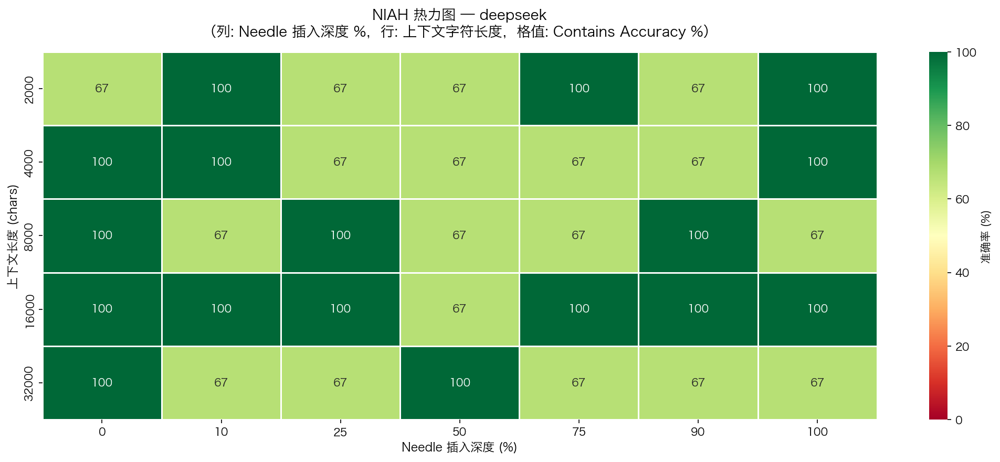
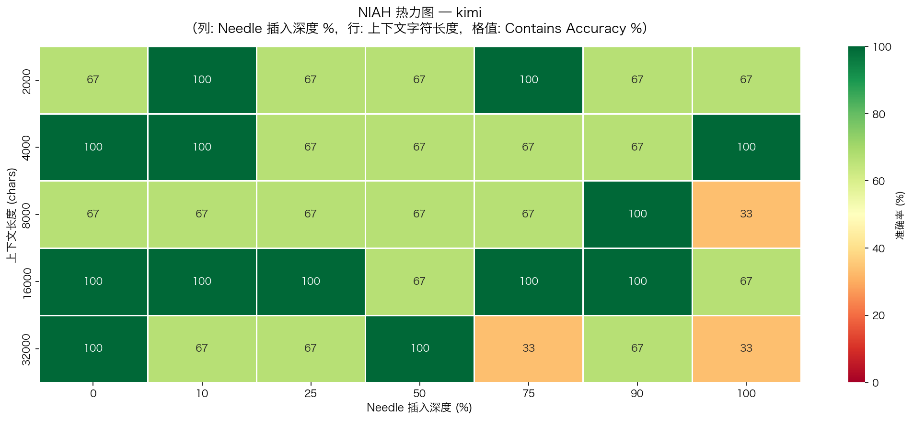
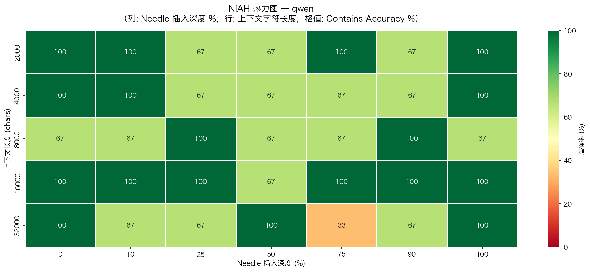

# LLM 长上下文能力评测框架

[](https://github.com/melody-ling-L/llm-long-context-eval-zh/actions/workflows/lint.yml)
[](LICENSE)
[](#最终结果--final-v1)
[](#最终结果--final-v1)
[](#最终结果--final-v1)
[](#预算估算)
[](#最终结果--final-v1)

> 面向中文长上下文场景的 NIAH / 位置偏差评测框架，用于验证 **"Lost in the Middle"** 是否稳定出现，以及不同模型是否真的能把长上下文用起来。
>
> 当前 README 展示的是 **final v1** 结果：已完成 **315 / 315** 条有效样本，覆盖率 **100%**。这版结论可以作为项目定稿发布；下一步优化重点不再是“补齐数据”，而是提升统计置信度和评测难度。

---

## 最终结果 / Final v1

| DeepSeek-V3 | Kimi | Qwen-Long |
|---|---|---|
|  |  |  |

本轮完整评测共 **315 条有效样本**：3 个模型 × 5 个上下文长度 × 7 个深度点 × 3 次重复。每个模型在每个 `context_length × depth_pct` 格子中都恰好有 **3 次重复**，数据已经齐平。

| 模型 | N | EM | Contains | Gap (Contains - EM) | 平均延迟 |
|------|:--:|:--:|:--------:|:-------------------:|:-------:|
| Qwen-Long | 105 | **80.0%** | **82.9%** | **2.9pp** | 1.10s |
| DeepSeek-V3 | 105 | 64.8% | **82.9%** | 18.1pp | **1.01s** |
| Kimi (Moonshot) | 105 | 65.7% | 76.2% | 10.5pp | 1.70s |

### Key Findings

- **位置偏差被完整复现，但形状更接近 W 型而不是标准 U 型。** 整体准确率在 depth=0% / 10% 时最高（91.1% / 86.7%），在 50% 处降到最低点（73.3%），75% 仍处低位（75.6%），随后在 90%-100% 回升到 80.0%。
- **Qwen 的严格精度最高，DeepSeek 的综合效率最佳。** Qwen 的 EM 达到 80.0%，而 DeepSeek 用 1.01s 的平均延迟拿到了与 Qwen 持平的 Contains（82.9%）；如果业务更看重“答对且答得短”，Qwen 更稳，如果更看重吞吐与成本，DeepSeek 更实用。
- **Kimi 在长上下文下退化最明显。** Kimi 的 Contains 只有 76.2%，且在 8K 与 32K 场景都掉到 66.7%，同时平均延迟 1.70s，是三者中最慢的一档。
- **16K 是这一轮中文 NIAH 的共同峰值。** DeepSeek 与 Qwen 在 16K 都达到 95.2%，Kimi 也达到 90.5%；当窗口扩到 32K 后，三个模型都出现回落，说明“支持更长 context window”不等于“对更长上下文的稳定利用”。

## 实验局限 / Limitations

- 这版数据已经完整，但**每个格子仍只有 3 次重复**。它足以支撑 v1 的方向性结论，却不足以对局部异常点做强统计推断；下一版应把重复数提升到 `N >= 10`。
- 当前结果呈现 **W 型 / 双低谷结构**，而不是英文文献中的标准 U 型。这可能反映中文长文本的注意力分布差异，也可能仍受小样本波动影响，需要更高重复数才能做稳健判断。
- 这版 NIAH 的 needle 与 haystack 风格差异较大，模型可能部分依赖关键词检索，而不是真正的长程语义整合。下一版需要引入**风格对齐的 needle**和 **multi-key NIAH**，降低模式匹配带来的虚高准确率。
- EM 与 Contains 的差值不只是“评分松紧差异”，它也在测量模型的**答案简洁度**。后续版本应把答案长度、输出 token 成本与两类准确率一起纳入分析，而不只盯着正确率本身。

## V2 Roadmap

1. 把单格重复数从 3 提升到 10，收窄置信区间，验证 16K / 32K 段是否真的存在反弹或塌陷。
2. 引入风格对齐的 needle、真假难辨的数值 needle，以及 multi-key NIAH，降低关键词检索偏置。
3. 增加答案长度、输出 token、单位正确率成本等指标，把“答对”与“答得省”分开看。
4. 扩展多跳推理和跨领域文档，验证结论能否从 NIAH 泛化到更贴近真实业务的中文长文档场景。

---

## 项目简介

本项目评测主流 LLM（DeepSeek-V3、Kimi、Qwen-Long）在长上下文场景下的真实能力：
- 官宣支持 128K，但模型真的能**用**这 128K 吗？
- 信息藏在文档**中间**时，模型是否会"失忆"？

---

## 评测维度

| 维度 | 说明 | 关键指标 |
|---|---|---|
| **NIAH** | Needle in a Haystack，在不同位置插入关键信息 | Accuracy @depth × length |
| **多跳推理** | 信息分散在文档多处，需综合推理 | Multi-hop Accuracy |
| **位置偏差** | 信息在开头/中间/结尾的准确率差异 | Position Bias Score |
| **跨模型对比** | DeepSeek-V3 vs Kimi vs Qwen-Long | Δ Accuracy |

---

## 项目结构

```
Eval/
├── configs/
│   └── eval_config.yaml        # 模型配置、评测参数
├── data/
│   ├── raw/                    # 放入原始长文档 (.txt / .md)
│   ├── needles/                # 多跳推理 QA 标注文件
│   └── processed/              # 生成的数据集 .jsonl
├── src/
│   ├── data_prep.py            # 构造 NIAH / 多跳数据集
│   ├── eval_runner.py          # 调用模型 API，存储结果
│   ├── metrics.py              # EM / Contains 评分
│   └── visualize.py            # 热力图、折线图、位置偏差图
├── notebooks/
│   ├── 01_data_preparation.ipynb
│   ├── 02_eval_runner.ipynb
│   ├── 03_analysis_visualization.ipynb
│   └── 04_report.ipynb
├── results/
│   ├── raw/                    # 原始 API 结果 .csv
│   ├── processed/              # 评分后结果 .csv
│   └── figures/                # 可视化图表
├── docs/
│   └── eval_design.md          # 评测方案设计文档
├── .env.example                # API Key 配置模板
└── requirements.txt
```

---

## 快速开始

### 1. 安装依赖
```bash
pip install -r requirements.txt
```

### 2. 配置 API Key
```bash
cp .env.example .env
# 编辑 .env，填入各模型 API Key
```

### 3. 准备数据
在 `data/raw/` 放入中文长文档（财报 PDF 转文本、论文、小说等），然后：
```bash
python src/data_prep.py
```

### 4. 运行评测（推荐在 Notebook 中逐步执行）
```
notebooks/01_data_preparation.ipynb  →  构造数据集
notebooks/02_eval_runner.ipynb       →  调用模型 API
notebooks/03_analysis_visualization.ipynb  →  分析 + 可视化
```

<details>
<summary>如何复现当前 final v1 结果</summary>

1. 运行 `notebooks/01_data_preparation.ipynb`，生成 `data/processed/niah_dataset.jsonl`。
2. 运行 `notebooks/02_eval_runner.ipynb`，保持 `RESUME=True`，直到 `results/raw/raw_results.csv` 达到 315 条目标样本。
3. 运行 `notebooks/03_analysis_visualization.ipynb`，确认 Step 1 输出 coverage = 100%，并生成 `results/figures/` 下的全部图表。
4. 最后运行 `notebooks/04_report.ipynb`，导出最终报告 HTML。

</details>

---

## 预算估算

| 模型 | 约 200 样本 × 平均 32K tokens |
|---|---|
| DeepSeek-V3 | ~¥5 |
| Kimi (moonshot-v1-128k) | ~¥15 |
| Qwen-Long | ~¥5 |

---

## 参考论文

- [Lost in the Middle (Liu et al., 2023)](https://arxiv.org/abs/2307.03172)
- [RULER: What's the Real Context Window of Your LLM? (Hsieh et al., 2024)](https://arxiv.org/abs/2404.06654)
- [Needle in a Haystack (Kamradt, 2023)](https://github.com/gkamradt/LLMTest_NeedleInAHaystack)

---

## 简历描述模板

> **LLM 长上下文能力评测项目** | 个人项目
> - 设计 4 维度评测框架（NIAH、多跳推理、位置偏差、跨模型对比），覆盖 200+ 测试样本
> - 在 DeepSeek-V3、Kimi、Qwen-Long 上定量验证 "Lost in the Middle" 在中文场景的表现
> - 输出位置-准确率热力图等可视化分析报告，[GitHub 链接]
