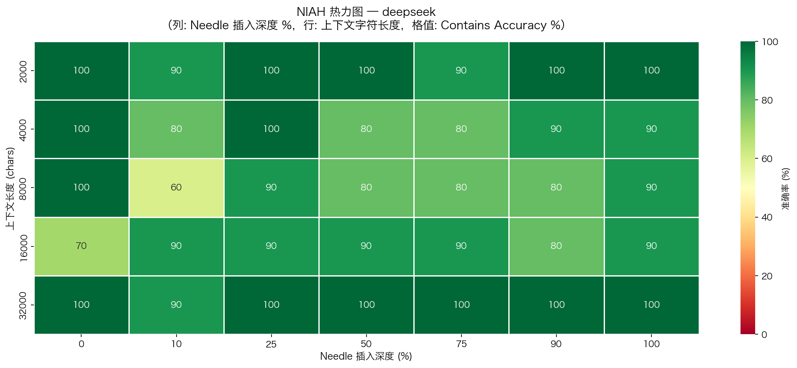
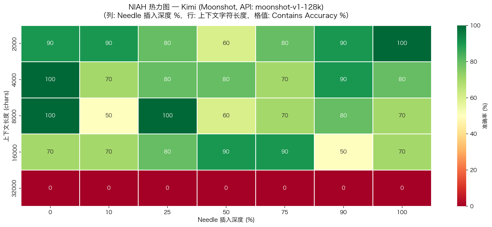
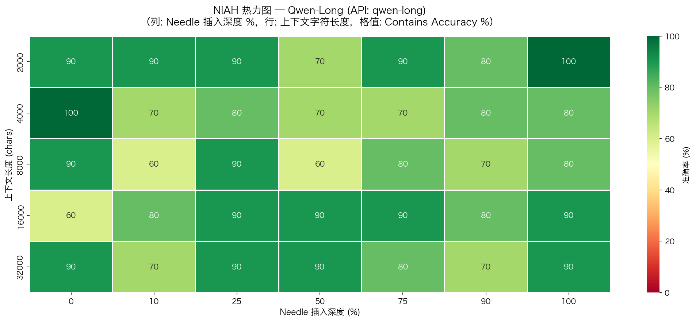
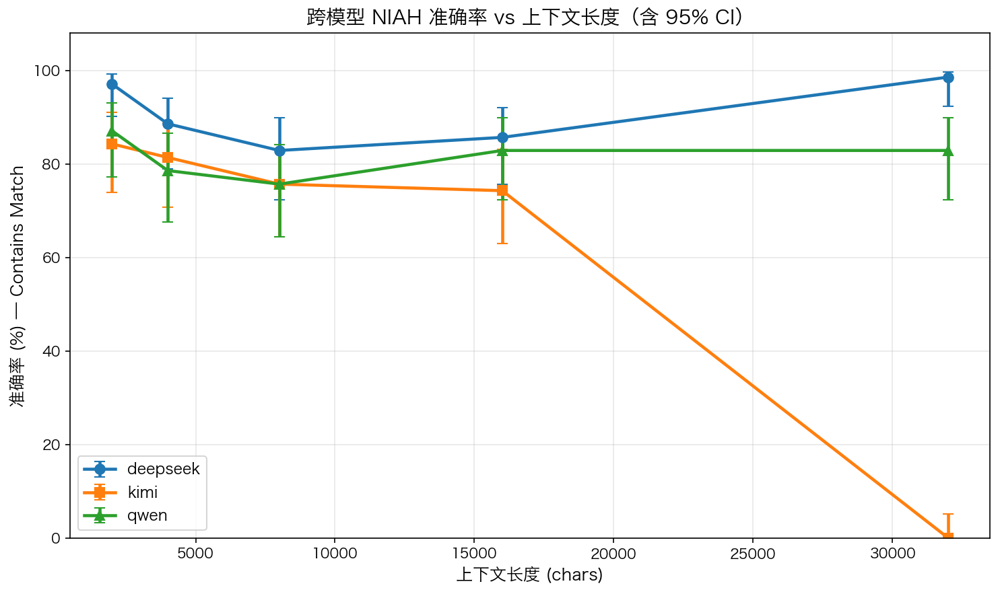
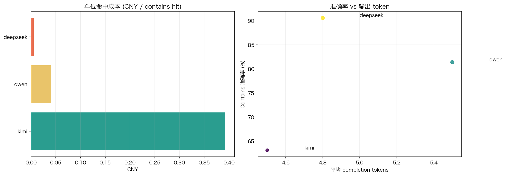

# LLM 长上下文能力评测框架 V2

[](https://github.com/melody-ling-L/llm-long-context-eval-zh-V2/actions/workflows/lint.yml)
[](LICENSE)
[](#v2-results)
[](#v2-results)
[](#methodology)
[](#v2-results)

> 面向中文长上下文场景的 **V2 基准仓库**。这一版把单格重复数从 3 提高到 10，并引入 `style_aligned`、`numeric_confusable`、`multi_key` 三类更难的中文 NIAH 变体。
>
> 当前仓库已经包含 **完整 V2 结果**：3 个模型、5 个上下文长度、7 个深度点、10 次重复，共 **1050 条有效 NIAH 评测结果**，附带 `results/v2/` 下的汇总表与图表。

V1 基线仓库见：[llm-long-context-eval-zh](https://github.com/melody-ling-L/llm-long-context-eval-zh)

---

## GitHub 直接查看

- GitHub 渲染报告：[`results/v2/report/04_report_v2.executed.ipynb`](results/v2/report/04_report_v2.executed.ipynb)
- 源 notebook：[`notebooks/v2/04_report_v2.ipynb`](notebooks/v2/04_report_v2.ipynb)
- HTML 下载版：[`v2.0.0 HTML 报告`](https://github.com/melody-ling-L/llm-long-context-eval-zh-V2/releases/download/v2.0.0/llm-long-context-eval-zh-V2-report.html)

---

## V2 Results

| DeepSeek | Kimi | Qwen |
|---|---|---|
|  |  |  |

| Accuracy by Length with 95% CI | Efficiency Tradeoff |
|---|---|
|  |  |

### Headline Metrics

| 模型 | N | EM | Contains | 95% CI | 平均延迟 | 平均输出 tokens | 单位命中成本 |
|---|---:|---:|---:|---:|---:|---:|---:|
| DeepSeek | 350 | 61.1% | **90.6%** | 87.1% - 93.2% | **0.73s** | 4.8 | **¥0.0057 / hit** |
| Kimi | 350 | 58.9% | 63.1% | 58.0% - 68.0% | 1.06s | **4.5** | ¥0.3919 / hit |
| Qwen | 350 | **80.0%** | 81.4% | 77.0% - 85.2% | 7.14s | 5.5 | ¥0.0397 / hit |

### Variant Breakdown

| 模型 | style_aligned | numeric_confusable | multi_key |
|---|---:|---:|---:|
| DeepSeek | **94.0%** | 86.0% | 91.7% |
| Kimi | 69.8% | 53.5% | 65.8% |
| Qwen | 89.7% | 62.3% | **91.7%** |

### Key Findings

- **DeepSeek 在 V2 中拿到了最高的 Contains 和最低的单位命中成本。** 90.6% 的 Contains 配合 ¥0.0057 / hit，使它成为当前这版 V2 中最强的综合效率模型。
- **`numeric_confusable` 是平均最难的变体。** 这说明相近数字 / 字符串干扰比 style 对齐或多 key 干扰更稳定地击穿检索表现，应该被视为 V2 的 headline insight。
- **Kimi 在 32K 上不是轻微波动，而是接近稳定失效。** 当前 32K 汇总为 0.0%，Wilson 95% CI 上界也只有 5.2%，更像真实塌陷而不是偶然抽样结果。
- **16K / 32K 在 V2 中不再表现为“所有模型统一退化”。** DeepSeek 在 32K 出现强反弹，Qwen 在 16K 和 32K 基本持平，Kimi 则在 32K 崩塌。这说明更高重复数确实把“模型差异”放大了出来。

---

## Methodology

V2 相比 V1 的关键变化：

1. 将单格重复数从 3 提高到 10，使 `context_length × depth_pct` 的统计更稳。
2. 引入三类更难的中文 NIAH 变体：
   - `style_aligned`：needle 与上下文文风更接近。
   - `numeric_confusable`：存在多个相近数字或近义指标，不能靠关键词秒取。
   - `multi_key`：同时插入 target 和 distractor，需要做更精细的定位。
3. 增加 V2 效率指标：`response_chars`、`completion_tokens`、`row_cost_cny`、`cost_per_contains_hit_cny`、`contains_per_1k_output_tokens`。
4. 所有 V2 数据、结果和 notebook 都与 V1 隔离，避免覆盖既有结论。

本轮完整 V2 NIAH 规模为：

- 3 个模型：DeepSeek / Kimi / Qwen
- 5 个长度：2K / 4K / 8K / 16K / 32K
- 7 个深度点：0 / 10 / 25 / 50 / 75 / 90 / 100
- 10 次重复
- 合计 350 条样本 / 模型，1050 条评测结果

---

## Repository Layout

```text
llm-long-context-eval-zh-V2/
├── configs/
│   ├── eval_config.yaml
│   └── eval_config_v2.yaml
├── data/
│   ├── needles/
│   │   ├── multihop_qa.json
│   │   ├── multihop_qa_v2.json
│   │   └── v2_needle_bank.json
│   ├── processed/
│   └── processed/v2/
├── docs/
│   ├── eval_design.md
│   └── eval_design_v2.md
├── notebooks/
│   ├── 01_data_preparation.ipynb
│   ├── 02_eval_runner.ipynb
│   ├── 03_analysis_visualization.ipynb
│   ├── 04_report.ipynb
│   └── v2/
├── results/
│   ├── figures/
│   ├── processed/
│   ├── raw/
│   └── v2/
│       ├── figures/
│       ├── processed/
│       └── raw/
└── src/
    ├── data_prep.py
    ├── data_prep_v2.py
    ├── eval_runner.py
    ├── eval_runner_v2.py
    ├── metrics.py
    ├── metrics_v2.py
    └── visualize.py
```

---

## Reproduce V2

### 1. Install

```bash
pip install -r requirements.txt
```

### 2. Configure API keys

```bash
cp .env.example .env
# fill in DEEPSEEK_API_KEY / MOONSHOT_API_KEY / DASHSCOPE_API_KEY
```

### 3. Generate V2 datasets

```bash
python src/data_prep_v2.py
```

或直接运行：

```text
notebooks/v2/01_data_preparation_v2.ipynb
```

### 4. Run V2 evaluation

```text
notebooks/v2/02_eval_runner_v2.ipynb
```

### 5. Run V2 analysis and report

```text
notebooks/v2/03_analysis_visualization_v2.ipynb
notebooks/v2/04_report_v2.ipynb
```

V2 关键产物路径：

- `results/v2/raw/raw_results.csv`
- `results/v2/processed/scored_results.csv`
- `results/v2/processed/summary_by_model.csv`
- `results/v2/processed/summary_by_model_variant.csv`
- `results/v2/processed/summary_by_model_length.csv`
- `results/v2/figures/*.png`

---

## Current Limits

- `multi_hop` 数据集已经生成到 `data/processed/v2/multihop_dataset.jsonl`，但当前对外主结论仍以 NIAH 为主。
- Kimi 在 32K 上的极差结果，在当前配置下更像稳定失效信号；但如果要追到根因，仍需要单独排查模型接口、提示词与上下文策略。
- 这版已经比 V1 稳很多，但仍是单轮公开快照；更完整的下一步应该是补齐 multi-hop 结果，并把跨任务摘要纳入同一份报告。

---

## References

- [Lost in the Middle (Liu et al., 2023)](https://arxiv.org/abs/2307.03172)
- [RULER: What's the Real Context Window of Your LLM? (Hsieh et al., 2024)](https://arxiv.org/abs/2404.06654)
- [Needle in a Haystack (Kamradt, 2023)](https://github.com/gkamradt/LLMTest_NeedleInAHaystack)
