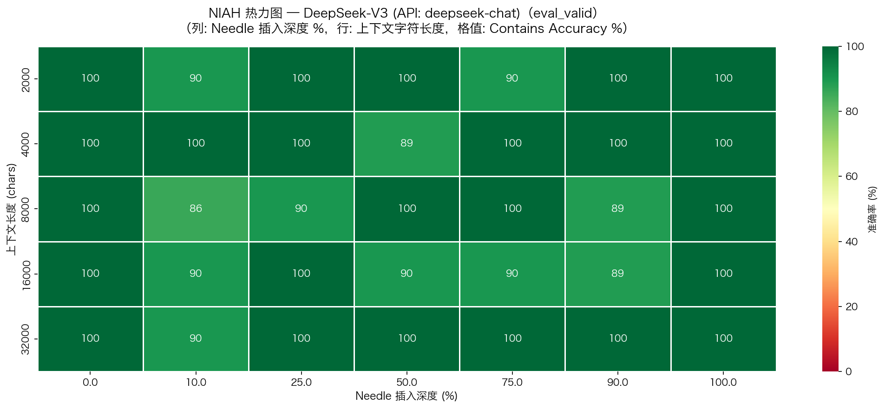
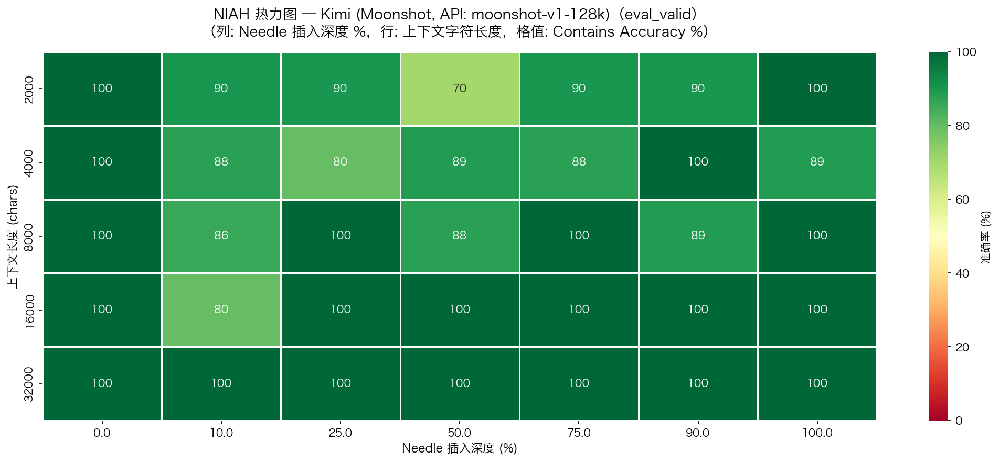
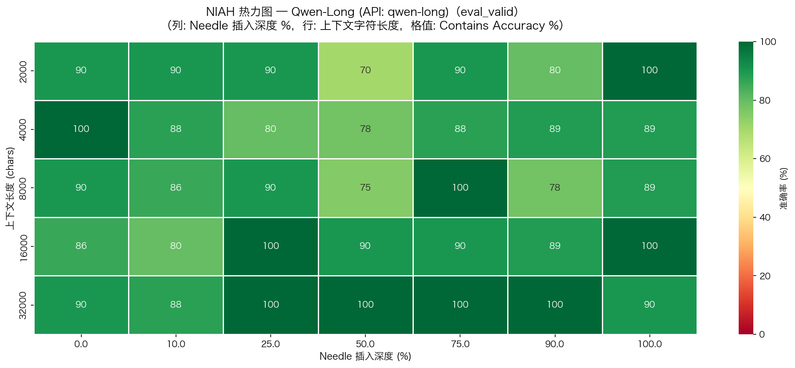
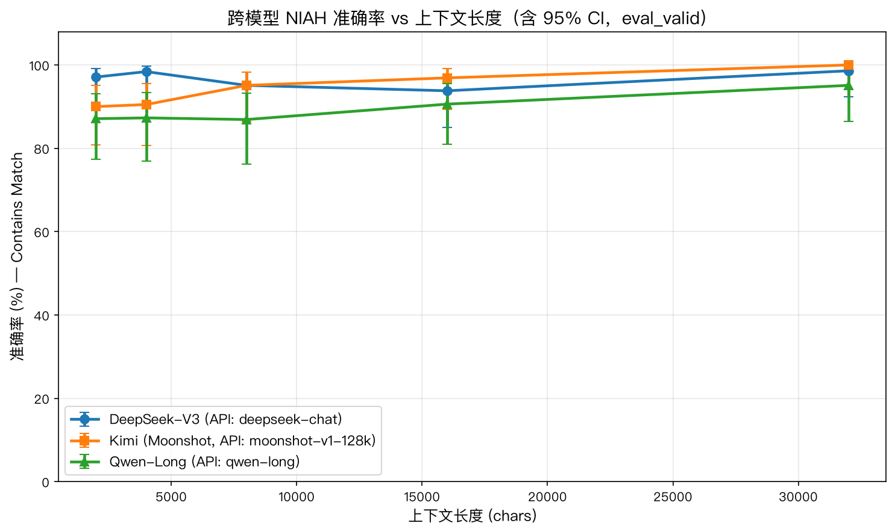
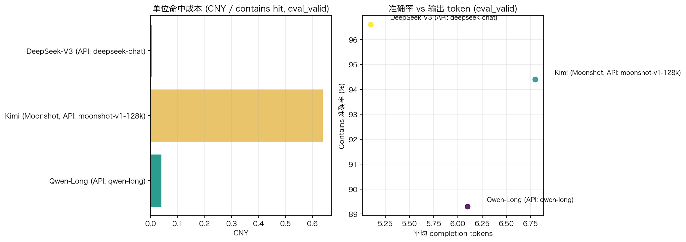

# LLM 长上下文能力评测框架 V2

[](https://github.com/melody-ling-L/llm-long-context-eval-zh-V2/actions/workflows/lint.yml)
[](LICENSE)
[](#v2-results)
[](#multi-hop-pilot)
[](#v2-results)
[](#methodology)
[](#v2-results)

> 面向中文长上下文场景的 **V2 基准仓库**。这一版把单格重复数从 3 提高到 10，并引入 `style_aligned`、`numeric_confusable`、`multi_key` 三类更难的中文 NIAH 变体。
>
> 当前仓库包含 **完整 V2 结果层**：3 个模型、5 个上下文长度、7 个深度点、10 次重复，共 **1050 条 NIAH 原始调用 + 96 条 multi_hop 结果（32 条/模型）**，附带 `results/v2/` 下的汇总表、taxonomy CSV 与报告图表。
>
> **主口径说明（Scheme A）**：报告中的模型能力指标默认基于 `eval_valid` 有效样本，排除 `content_filter`（平台内容审核拦截）与 `infra_api_failed`（余额耗尽、限流等基础设施失败）。这些失败不应计入模型检索能力。

V1 基线仓库见：[llm-long-context-eval-zh](https://github.com/melody-ling-L/llm-long-context-eval-zh)

---

## GitHub 直接查看

- GitHub 渲染报告：`results/v2/report/04_report_v2.executed.ipynb`
- 源 notebook：`notebooks/v2/04_report_v2.ipynb`
- HTML 下载版：[v2.0.0 HTML 报告](https://github.com/melody-ling-L/llm-long-context-eval-zh-V2/releases/tag/v2.0.0)
- **主口径 NIAH 汇总**：`results/v2/processed/summary_by_model_niah_valid_only.csv`
- 调用状态诊断：`results/v2/processed/summary_call_status.csv`
- badcase taxonomy 汇总：`results/v2/processed/summary_by_badcase_taxonomy.csv`
- 任务级汇总：`results/v2/processed/summary_by_model_task.csv`

---

## V2 Results

| DeepSeek | Kimi | Qwen |
|---|---|---|
|  |  |  |

| Accuracy by Length with 95% CI | Efficiency Tradeoff |
|---|---|
|  |  |

### NIAH Headline Metrics（eval_valid 主口径）

| 模型 | eval_valid / 350 | EM | Contains | 95% CI | 平均延迟 | 平均输出 tokens | 单位命中成本 |
|------|:--:|:--:|:--------:|:------:|:-------:|:-------------:|:------------:|
| DeepSeek | 328 | 65.2% | **96.6%** | 94.1% - 98.1% | **0.78s** | 5.1 | **¥0.0057 / hit** |
| Kimi | 319 | **89.7%** | 94.4% | 91.3% - 96.4% | 2.25s | 6.8 | ¥0.6388 / hit |
| Qwen | 319 | 87.8% | 89.3% | 85.5% - 92.3% | 7.83s | 6.1 | ¥0.0397 / hit |

> 若直接对全部 350 条原始行取平均，Kimi Contains 会虚降至 **86.0%**（含 31 条 `content_filter` 与早期 32K 基础设施失败）。**请勿用该数字作为 headline。**

### 调用状态诊断

| 模型 | 总调用 | eval_valid | content_filter | infra_api_failed |
|------|:--:|:--:|:--:|:--:|
| DeepSeek | 350 | 328 (93.7%) | 0 | 22 (6.3%) |
| Kimi | 350 | 319 (91.1%) | **31 (8.9%)** | 0 |
| Qwen | 350 | 319 (91.1%) | 0 | 31 (8.9%) |

- **Kimi `content_filter`**：Moonshot 平台对含政治/经济敏感百科 haystack 的 31 条样本触发「高风险内容」拦截，与模型检索能力无关。
- **DeepSeek / Qwen `infra_api_failed`**：主要为部分长度点的 API 超时或调用失败（`prompt_tokens=0`），已在 `eval_valid` 口径中排除。

### Variant Breakdown（eval_valid）

| 模型 | style_aligned | numeric_confusable | multi_key |
|------|:--:|:--:|:--:|
| DeepSeek | **100.0%** | 89.9% | **100.0%** |
| Kimi | **100.0%** | 82.9% | **100.0%** |
| Qwen | **100.0%** | **67.6%** | **100.0%** |

### 按上下文长度（eval_valid Contains）

| 模型 | 2K | 4K | 8K | 16K | 32K |
|------|:--:|:--:|:--:|:--:|:--:|
| DeepSeek | 97.1% | 98.4% | 95.1% | 93.8% | 98.6% |
| Kimi | 90.0% | 90.5% | 95.1% | 96.9% | **100.0%** |
| Qwen | 87.1% | 87.3% | 86.9% | 90.6% | 95.1% |

### Key Findings

- **DeepSeek 在 V2 eval_valid 口径下拿到最高 Contains（96.6%）和最低单位命中成本（¥0.0057 / hit）。** 综合效率仍是三者中最强。
- **Kimi 32K 并非模型能力塌陷。** 早期 README 中「32K 0% / 稳定失效」来自 Moonshot **余额耗尽**（`prompt_tokens=0`）与后续 **content_filter** 叠加；在 61 条 eval_valid 32K 样本上，Kimi Contains 为 **100.0%**。
- **`numeric_confusable` 仍是平均最难的变体。** Qwen 仅 67.6%，Kimi 82.9%，DeepSeek 89.9%；相近数字 / 字符串干扰比 style 对齐或多 key 干扰更稳定地击穿检索表现。
- **badcase taxonomy（eval_valid）显示主要短板是答案格式而非纯召回失败。** 「输出冗余但包含正确答案」占 **66.1%**，「被相似数字干扰」占 **33.9%**；DeepSeek 的主要问题更像抽取格式与回答收敛，而不是找不到 needle。
- **16K / 32K 在 V2 中不再表现为「所有模型统一退化」。** DeepSeek 与 Kimi 在 32K 均保持高位，Qwen 在 16K / 32K 也回升；更高重复数把「模型差异」和「基础设施噪声」都放大了出来。
- **评测工程教训：必须持久化 `error` 字段并区分失败类型。** 没有 `content_filter` / `infra_api_failed` 分层，很容易把计费失败误读成「长上下文失忆」。

### Badcase Taxonomy Headline（eval_valid）

| 错误类型 | 占全部 badcase 比例 | 首页结论 |
|----------|:--:|---------|
| 输出冗余但包含正确答案 | **66.1%** | DeepSeek 的主要短板更像抽取格式与回答收敛问题，而不是纯召回失败。 |
| 被相似数字干扰 | **33.9%** | 相近数字、比例、时间和单位混排是当前最值得补样本的干扰模式。 |

更细的按模型拆分见：`results/v2/processed/summary_by_model_badcase_taxonomy.csv`

### multi-hop Pilot

| 模型 | N | EM | Contains | 95% CI | 说明 |
|------|:--:|:--:|:--------:|:------:|------|
| DeepSeek | 32 | 43.8% | 65.6% | 48.3% - 79.6% | 2-hop 74.1%，3-hop 20.0%；命中成本最低。 |
| Qwen | 32 | 68.8% | 68.8% | 51.4% - 82.0% | 2-hop 74.1%，3-hop 40.0%；EM 更稳但成本更高。 |
| Kimi | 32 | 50.0% | 56.2% | 39.3% - 71.8% | 2-hop 66.7%，**3-hop 0.0%**；长距离多步综合明显偏弱。 |

当前 multi_hop 已覆盖 **3 个模型各 32 条**（事实分散嵌入 ~8000 字符长文）。按跳数拆分见：`results/v2/processed/summary_multihop_by_hops.csv`

### Actionable Assets

- 主口径 NIAH 汇总：`results/v2/processed/summary_by_model_niah_valid_only.csv`
- 调用状态：`results/v2/processed/summary_call_status.csv`
- badcase 总体汇总：`results/v2/processed/summary_by_badcase_taxonomy.csv`
- badcase 按模型汇总：`results/v2/processed/summary_by_model_badcase_taxonomy.csv`
- 代表性失败样本：`results/v2/processed/badcase_examples.csv`
- 真实任务子集扩充路线：`results/v2/processed/real_task_subset_roadmap.csv`

---

## Methodology

V2 相比 V1 的关键变化：

1. 将单格重复数从 3 提高到 10，使 `context_length × depth_pct` 的统计更稳。
2. 引入三类更难的中文 NIAH 变体：
   - `style_aligned`：needle 与上下文文风更接近。
   - `numeric_confusable`：存在多个相近数字或近义指标，不能靠关键词秒取。
   - `multi_key`：同时插入 target 和 distractor，需要做更精细的定位。
3. 增加 V2 效率指标：`response_chars`、`completion_tokens`、`row_cost_cny`、`cost_per_contains_hit_cny`、`contains_per_1k_output_tokens`。
4. 增加 **Scheme A 调用状态分层**：`eval_valid` / `content_filter` / `infra_api_failed`，模型能力指标默认只看 `eval_valid`。
5. 所有 V2 数据、结果和 notebook 都与 V1 隔离，避免覆盖既有结论。

本轮完整 V2 NIAH 规模为：

- 3 个模型：DeepSeek / Kimi / Qwen
- 5 个长度：2K / 4K / 8K / 16K / 32K
- 7 个深度点：0 / 10 / 25 / 50 / 75 / 90 / 100
- 10 次重复
- 合计 350 条样本 / 模型，1050 条 NIAH 原始调用

---

## Repository Layout

```
llm-long-context-eval-zh-V2/
├── configs/
│   ├── eval_config.yaml
│   └── eval_config_v2.yaml
├── data/
│   ├── needles/
│   │   ├── multihop_qa.json
│   │   ├── multihop_qa_v2.json
│   │   └── v2_needle_bank.json
│   ├── processed/
│   └── processed/v2/
├── docs/
│   ├── eval_design.md
│   └── eval_design_v2.md
├── notebooks/
│   ├── 01_data_preparation.ipynb
│   ├── 02_eval_runner.ipynb
│   ├── 03_analysis_visualization.ipynb
│   ├── 04_report.ipynb
│   └── v2/
├── results/
│   ├── figures/
│   ├── processed/
│   ├── raw/
│   └── v2/
│       ├── figures/
│       ├── processed/
│       └── raw/
└── src/
    ├── data_prep.py
    ├── data_prep_v2.py
    ├── eval_runner.py
    ├── eval_runner_v2.py
    ├── metrics.py
    ├── metrics_v2.py
    └── visualize.py
```

---

## Reproduce V2

### 1. Install

```bash
pip install -r requirements.txt
```

### 2. Configure API keys

```bash
cp .env.example .env
# fill in DEEPSEEK_API_KEY / MOONSHOT_API_KEY / DASHSCOPE_API_KEY
```

> **Kimi NIAH 必须使用 `MOONSHOT_API_KEY`（`api.moonshot.cn`）。** `KIMI_API_KEY` 仅适用于 Kimi Coding Agent，无法调用 `moonshot-v1-128k`。

### 3. Generate V2 datasets

```bash
python src/data_prep_v2.py
```

或直接运行：

```
notebooks/v2/01_data_preparation_v2.ipynb
```

### 4. Run V2 evaluation

```
notebooks/v2/02_eval_runner_v2.ipynb
```

### 5. Run V2 analysis and report

```
notebooks/v2/03_analysis_visualization_v2.ipynb
notebooks/v2/04_report_v2.ipynb
```

或一键重评分 + 出图（主口径 eval_valid）：

```bash
python scripts/rerun_kimi_v2.py --analyze-only
python scripts/regenerate_v2_figures.py
```

V2 关键产物路径：

- `results/v2/raw/raw_results.csv`
- `results/v2/processed/scored_results.csv`
- `results/v2/processed/summary_by_model_niah_valid_only.csv` ← **主口径 headline**
- `results/v2/processed/summary_call_status.csv`
- `results/v2/processed/summary_by_model_variant.csv`
- `results/v2/processed/summary_by_model_length.csv`
- `results/v2/processed/summary_by_model_task.csv`
- `results/v2/processed/summary_by_model_badcase_taxonomy.csv`
- `results/v2/processed/summary_by_badcase_taxonomy.csv`
- `results/v2/processed/badcase_examples.csv`
- `results/v2/processed/real_task_subset_roadmap.csv`
- `results/v2/figures/*.png`

---

## Current Limits

- `multi_hop` 已覆盖 3 个模型各 32 条（96 条合计）。3-hop 仍是共同短板：Kimi 3-hop Contains 为 **0.0%**，DeepSeek 仅 20.0%，Qwen 相对最好（40.0%）。
- Kimi 有 31 条 `content_filter` 样本无法通过重试恢复，需要在数据层替换敏感 haystack 或接受「平台审核盲区」作为独立统计维度。
- DeepSeek / Qwen 各有约 31 条基础设施失败样本，长上下文评测应始终保留 `error` + `prompt_tokens` 字段以便事后诊断。
- badcase taxonomy 已经能指导下一轮数据策略，但规则仍是启发式首版，后续值得补更细的抽错值 / 单位混淆 / 时间推理子类。

---

## References

- [Lost in the Middle (Liu et al., 2023)](https://arxiv.org/abs/2307.03172)
- [RULER: What's the Real Context Window of Your LLM? (Hsieh et al., 2024)](https://arxiv.org/abs/2404.06654)
- [Needle in a Haystack (Kamradt, 2023)](https://github.com/gkamradt/LLMTest_NeedleInAHaystack)
